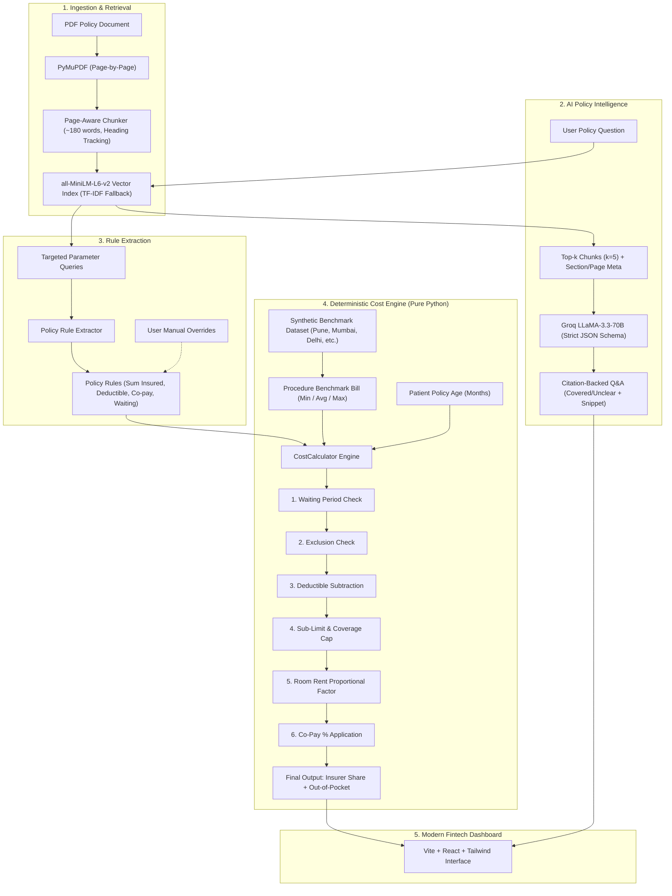

# FIN01 – Policy-to-Patient: Insurance Policy Intelligence Assistant

[](https://hackmatrix.org)
[](https://fastapi.tiangolo.com)
[-orange.svg)](https://pymupdf.readthedocs.io/)
[](https://huggingface.co/sentence-transformers/all-MiniLM-L6-v2)
[](https://vitejs.dev)
[](https://docs.pytest.org)

**FIN01 – Policy-to-Patient** bridges the opacity between complex health insurance policy contracts and patients facing medical procedures. It reads PDF policies page-by-page, performs semantic retrieval with strict page citations, extracts underwriting rules, and computes deterministic out-of-pocket costs across major Indian healthcare hubs.

Frontend:https://fin01-policy-to-patient.vercel.app/

Backend : https://fin01-policy-to-patient.onrender.com/
---

## 🎯 Hard Architectural Principles

1. **LLM Extracts & Explains; Python Computes Money**: The LLM is strictly confined to semantic parsing, explanation synthesis, and citation extraction. **Zero arithmetic is done by the LLM.** All deductible, sub-limit, co-payment, and room-rent prorations are evaluated deterministically in pure Python.
2. **Never Guess Missing Data (Audit Safety Lock)**: If a critical policy rule (e.g., co-pay percentage or coverage limit) is absent from the contract, the engine refuses to fabricate a point estimate. It sets status to `INSUFFICIENT_INFORMATION`, flags confidence `LOW`, highlights the missing fields in amber, and prompts the user to supply the verified value before calculating.
3. **Every Extracted Claim Carries Evidence**: Every answer and extracted parameter links to its originating page number, section heading, and a verbatim snippet (max 25 words).
4. **Resilient Local Architecture**: Operates with an in-memory session index powered by `sentence-transformers` (`all-MiniLM-L6-v2`) with automatic fallback to Scikit-Learn TF-IDF. No external vector databases or database servers required.

---

## 🏗️ Architecture & Data Flow



---

## 📁 Repository Structure

```
fin01/
├── .env.example              # Environment variables template
├── .gitignore                # Excludes secrets, venv, and node_modules
├── README.md                 # Complete system guide & demo documentation
├── backend/
│   ├── main.py               # FastAPI server, REST routers, CORS
│   ├── schemas.py            # Pydantic models for Q&A, citations, rules & calculations
│   ├── pdf_processor.py      # PyMuPDF page-wise text extraction & scanned page warning
│   ├── chunker.py            # Page-aware sliding chunker with section heading retention
│   ├── retriever.py          # Sentence-Transformers + Scikit-Learn TF-IDF fallback index
│   ├── llm.py                # Groq API client with strict JSON enforcement & heuristic fallback
│   ├── rule_extractor.py     # Multi-field semantic extractor with user-provided overrides
│   ├── cost_data.py          # Treatment cost dataset manager with national fallback
│   ├── calculator.py         # Deterministic pure-Python calculation engine & audit trail
│   ├── data/
│   │   └── treatment_costs.csv # 30+ synthetic cost rows across Indian tier-1/tier-2 cities
│   └── tests/
│       ├── __init__.py
│       └── test_calculator.py # 8 comprehensive unit tests for all scenarios & edge cases
├── samples/
│   ├── sample_health_policy.pdf          # 4-page realistic health policy (complete terms)
│   └── sample_policy_missing_copay.pdf   # 4-page policy with omitted co-payment
└── frontend/                 # Vite + React 18 + Tailwind CSS fintech dashboard
    ├── package.json
    ├── tailwind.config.js
    └── src/
        ├── App.jsx
        ├── api/client.js
        └── components/
            ├── Header.jsx
            ├── PolicyUpload.jsx
            ├── ExtractedRulesCard.jsx
            ├── PolicyQA.jsx
            ├── CostEstimator.jsx
            ├── CalculationResults.jsx
            └── UncertaintyAlert.jsx
```

---

## ⚡ Quick Start & Setup

### Prerequisites
- Python 3.11+
- Node.js 18+ and npm

### 1. Backend Setup
```bash
cd fin01
# Optional: create and activate virtual environment
python -m venv venv
# Windows:
venv\Scripts\activate
# Linux/macOS:
source venv/bin/activate

# Install dependencies
pip install pymupdf fastapi uvicorn python-multipart groq sentence-transformers pydantic pandas numpy scikit-learn pytest

# Configure environment variables
cp .env.example .env
# Edit .env and supply your GROQ_API_KEY (optional: if omitted, resilient heuristic fallback runs)
```

Run backend server:
```bash
cd backend
python -m uvicorn main:app --host 0.0.0.0 --port 8000 --reload
```
API Documentation will be live at `http://localhost:8000/docs`.

### 2. Frontend Setup
In a new terminal:
```bash
cd fin01/frontend
npm install
npm run dev
```
Open `http://localhost:5173` in your browser.

---

## 🧪 Automated Testing (Pytest)

The test suite validates all required business scenarios:
1. **Reference Example**: Bill ₹2,50,000, Deductible ₹10,000, Limit ₹2,00,000, Co-pay 20% ➔ Eligible ₹2,40,000 ➔ Capped ₹2,00,000 ➔ Co-pay ₹40,000 ➔ **Insurer: ₹1,60,000, OOP: ₹90,000**.
2. **Scenario 1 (Fully Covered)**: Within limits, zero deductible, 0% co-pay ➔ Insurer pays 100%.
3. **Scenario 2 (Limit Exceeded)**: Bill exceeds limit ➔ Insurer pays capped limit; patient pays remainder.
4. **Scenario 3 (Co-Pay Applied)**: 20% co-payment deducted from admissible amount.
5. **Scenario 4 (Waiting Period Not Satisfied)**: Policy age 10 months < 24 months requirement ➔ Claim refused, Insurer pays ₹0.
6. **Scenario 5 (Missing Information Refusal)**: Co-pay missing ➔ Status `INSUFFICIENT_INFORMATION`, zero points estimated.
7. **User Override Validation**: Supplying missing parameter restores calculation to `CALCULATED`.
8. **PDF Engine & Chunker**: Validates 4-page PyMuPDF extraction and section heading retention.

To run tests:
```bash
pytest backend/tests/test_calculator.py -v
```

---

## 🎬 3-Minute Hackathon Demo Script

Follow this step-by-step walkthrough for an end-to-end demo:

1. **One-Click Ingestion**:
   - Click **"Load Sample Policy"** in the top navigation bar.
   - The UI immediately shows **"4 Pages Indexed"** and displays the extracted policy parameters with page chips (`P.1`, `P.2`, `P.3`).
   - Click `P.1` or `P.2` on the rules card to inspect the exact contractual snippet.
2. **Ask Your Policy (Semantic Q&A)**:
   - Click the suggested question pill: `"Is knee replacement covered?"`.
   - The assistant returns `POTENTIALLY_COVERED` with **HIGH CONFIDENCE**, noting the 24-month waiting period and sub-limit of ₹2,00,000, citing **Page 2** and **Page 3** with clickable evidence snippets.
3. **Deterministic Out-of-Pocket Estimator**:
   - In the Cost Estimator, select **Treatment: Knee Replacement**, **City: Pune**, and **Policy Age: 36 Months**.
   - Click **"Calculate Out-of-Pocket Estimate"**.
   - Result:
     - Total Bill: `₹2,20,000`
     - Insurer Pays: `₹1,60,000` (73%)
     - You Pay Out-of-Pocket: `₹60,000` (27%)
   - Review the **Deterministic Calculation Audit Trail** below showing every step (Deductible, Sub-limit, Co-pay) with source page citations.
4. **Waiting Period Refusal (Test Non-Eligibility)**:
   - Move the **Policy Age slider to 10 Months**.
   - Click **Calculate**.
   - The engine returns **CLAIM NOT ADMISSIBLE**: `"Waiting period for 'Knee Replacement' is 24 months. Current policy age is 10 months. Insurer pays ₹0."`
5. **Uncertainty Safety Lock (Missing Co-Pay Demo)**:
   - In the header, click **"Sample (Missing Co-Pay)"**.
   - Attempt to calculate an estimate.
   - The system triggers the **Audit Safety Lock (Amber Warning Card)**:
     `"Unable to produce a reliable estimate. Missing: co-pay percentage. Please verify with the insurer."`
   - Notice the point estimate is refused.
   - Enter `20` in the inline Co-Payment box and click **"Supply Value & Calculate"**.
   - The calculation unlocks, showing the verified `₹1,60,000 / ₹60,000` split!

---

## 🚀 Deployment Guide

### Backend on Render / Railway
1. **Root Directory**: backend
2. **Build Command**: `pip install -r requirements.txt` (or `pip install pymupdf fastapi uvicorn python-multipart groq sentence-transformers pydantic pandas numpy scikit-learn`)
3. **Start Command**: `uvicorn main:app --host 0.0.0.0 --port $PORT`
4. **Environment Variables**: Add `GROQ_API_KEY`.

### Frontend on Vercel
1. **Root Directory**: frontend
2. **Framework Preset**: `Vite`
3. **Build Command**: `npm run build`
4. **Output Directory**: `dist`
5. **Environment Variable**: `VITE_API_URL=https://your-backend.onrender.com`

---

## ⚖️ Limitations & Future Roadmap

- **OCR for Handwritten/Scanned PDFs**: Current engine flags scanned pages with warnings. Integration with Tesseract OCR or Google Cloud Vision can be enabled for image-only scans.
- **Multiple Policy Aggregation**: Future extension to support primary employer insurance + super top-up policies sequentially.
- **Direct Hospital TPA Integration**: Connecting real-time cashless TPA pre-authorization portals.
